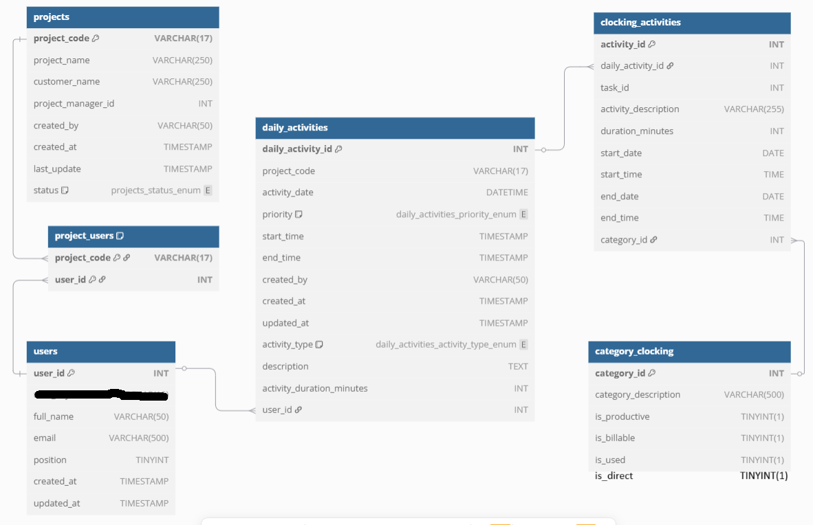

# Database Schema

## Table: `users` ambil dari `ss_user`

| Field          | Description                                              |
|----------------|----------------------------------------------------------|
| `user_id`      | Unique identifier for each user (auto-generated)          |
| `user_key`     | User key (mapped from `id_key` in the JSON)               |
| `full_name`    | Full name of the user (mapped from `name` in `ss_user`)   |
| `email`        | User's email address (mapped from `email` in `ss_user`)   |
| `position`     | Position or role of the user (mapped from `jabatan`)      |
| `created_at`   | Account creation date (mapped from `created_at` in `ss_user`) |
| `updated_at`   | Last update timestamp (mapped from `updated_at` in `ss_user`) |

## Table: `projects` ambil dari `ss_project_management`

| New Table Field         | Old Table Field (`ss_project_management`) | Description                     |
|-------------------------|------------------------------------------|---------------------------------|
| `project_code`          | `pr_project_code`                        | Project code                    |
| `project_name`          | `pr_project_name`                        | Project name                    |
| `customer_name`         | `pr_customer_name`                       | Customer name                   |
| `project_manager_id`    | `pr_pic_project`                         | Project manager ID              |
| `created_by`            | `pr_created_by`                          | Creator of the project          |
| `created_at`            | `pr_created_date`                        | Project creation date           |
| `last_update`           | `pr_last_update`                         | Last update timestamp           |
| `status`                | `pr_status`                              | Project status                  |

**Status Mapping**:
```json
{
  "p": "progress",
  "f": "finished",
  "i": "initial",
  "c": "cancelled"
}
```

## Table: `project_users` ambil dari JSON `pr_members`

| New Table Field         | Old Table Field (`pr_members`) | Description                     |
|-------------------------|--------------------------------|---------------------------------|
| `project_code`          | `pr_project_code`              | Project code                    |
| `user_id`               | `user_id`                      | User ID                         |
| `role`                  | `role`                         | Role in the project             |

## Table: `daily_activities` ambil dari JSON `da_data`

| New Table Field         | Old Table Field (`da_data`) | Description                     |
|-------------------------|----------------------------|---------------------------------|
| `daily_activity_id`     | `da_id`                    | Unique ID for daily activity     |
| `project_code`          | `da_project_code`          | Project code                    |
| `activity_date`         | `da_date`                  | Date of activity                 |
| `priority`              | `da_priority`              | Activity priority                |
| `start_time`            | `da_start_tm`              | Start time of activity           |
| `end_time`              | `da_end_tm`                | End time of activity             |

## Table: `category_clocking`

### Migration Mapping from `category_clocking` ambil dari `ss_category_clocking`

| `ss_category_clocking` Field | `category_clocking` Field      | Description                     |
|-----------------------------|-------------------------------|---------------------------------|
| `cc_id`                     | `category_id`                 | Category ID                     |
| `cc_definition`             | `category_description`        | Category description            |
| `cc_productive`             | `is_productive`               | Indicates if productive         |
| `cc_billable`               | `is_billable`                 | Indicates if billable           |
| `cc_direct`                 | (Not mapped, skipped)         | -                               |
| `cc_used`                   | `is_used`                     | Indicates if used               |

## Table: `daily_activity`

### Mapping from `daily_activity` ambil dari `da_activity` 

| `daily_activity` Field      | `da_activity` Field         | Description                              |
|-----------------------------|----------------------------|------------------------------------------|
| `daily_activity_id`         | `da_id`                    | Unique ID for daily activity             |
| `project_code`              | `da_project_code`          | Project code                             |
| `activity_date`             | `da_date`                  | Date of activity                         |
| `priority`                  | `da_priority`              | Activity priority                        |
| `start_time`                | `da_start_tm`              | Start time of activity                   |
| `end_time`                  | `da_end_tm`                | End time of activity                     |
| `created_by`                | `da_created_by`            | Creator of the activity                  |
| `created_at`                | `da_created_date`          | Creation date of activity                |
| `updated_at`                | `da_updated_date`          | Last update timestamp                    |
| `activity_type`             | `da_activity`              | Type of activity                         |
| `description`               | `da_keterangan`            | Activity description                     |
| `activity_duration_minutes` | `da_duration`              | Duration of activity in minutes          |
| (Mapped to `user_id`)       | `da_user_id`               | User ID (assumed to map to `created_by` or similar field) |


# ERD
